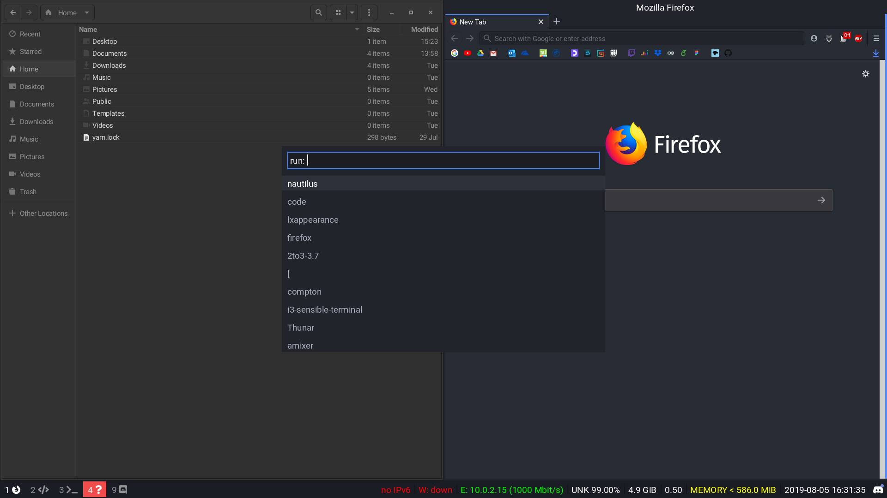

# .file
This is my configuration file for [i3](https://i3wm.org/) and [ArchLinux](https://www.archlinux.org/)
## Preview



## Features
- hyper Theme
- vs code setting and theme
- gtk theme/cursor/icon
- i3 config
- rofi theme
- fonts (Roboto)
- bash program
- Xwindows start file
- lock screen

## Requirements

- arch
- i3
- rofi
- hyper
- vscode

## Installation

Run the following commands in the terminal:

```sh
cd ~
git clone -o ./ https://github.com/JulesdeCube/LinuxConfig.git
sudo ./install.sh
```
## License

Materia is distributed under the terms of the GNU General Public License, version 3 or later.
